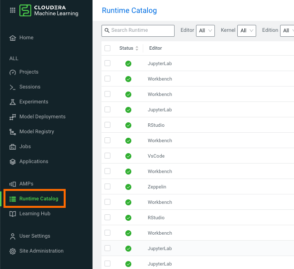
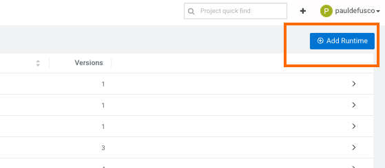
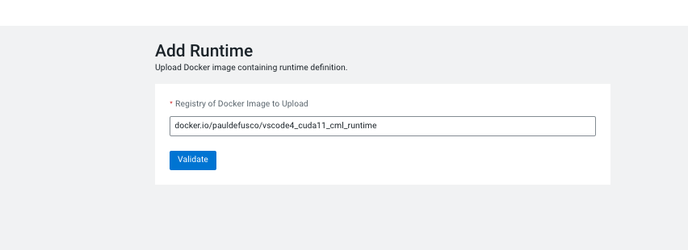
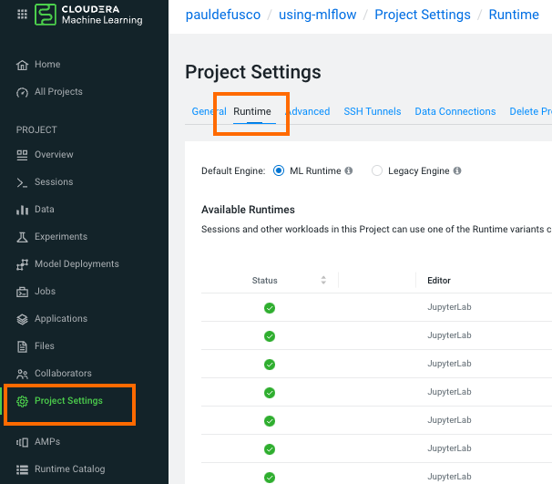
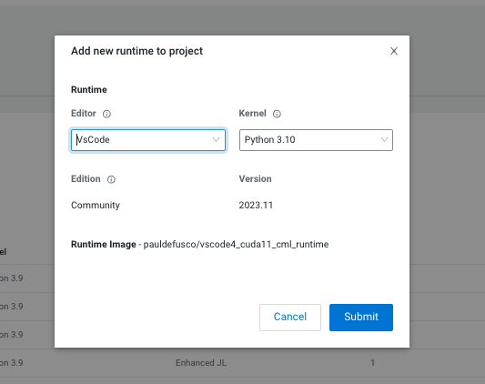
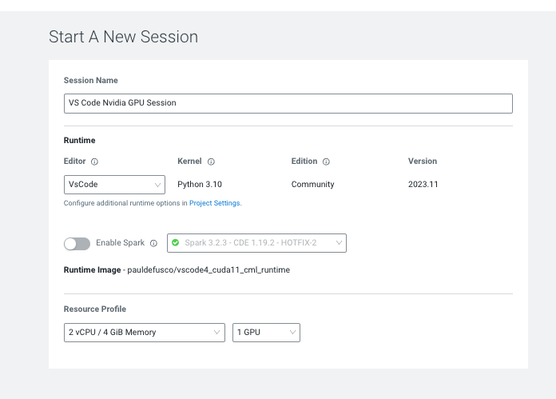
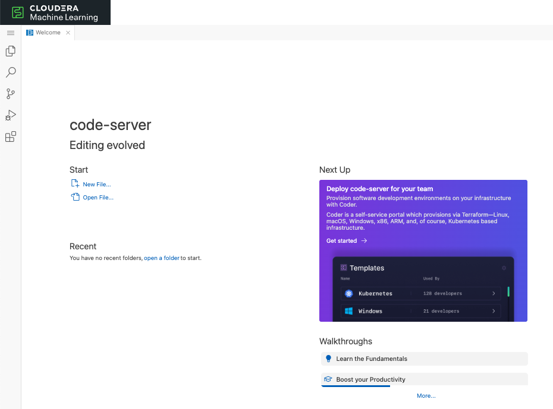
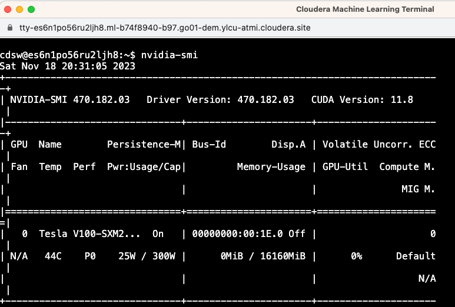

# CML Runtime with Nvidia Libs and VSCode Editor

This repository contains basic instructions for creating and deploying a Custom Runtime with VS Code and Nvidia libraries to your CML Workspace. With this runtime you can increase your productivity when developing your deep learning use cases in CML Sessions. This example is also valid for CDSW clusters.


## Using Custom Runtimes

Cloudera ML Runtimes are a set of Docker images created to enable machine learning development and host data applications in the Cloudera Data Platform (CDP) and the Cloudera Machine Learning (CML) service.

ML Runtimes provide a flexible, fully customizable, lightweight development and production machine learning environment for both CPU and GPU processing frameworks while enabling unfettered access to data, on-demand resources, and the ability to install and use any libraries/algorithms without IT assistance.

#### PBJ Runtimes

Powered by Jupyter (PBJ) Runtimes are the second generation of ML Runtimes. While the original ML Runtimes relied on a custom proprietary integration with CML, PBJ Runtimes rely on Jupyter protocols for ecosystem compatibility and openness.

#### Open Source

For data scientists who need to fully understand the environment they are working in, Cloudera provides the Dockerfiles and all dependencies in [this git repository](https://github.com/cloudera/ml-runtimes) that enables the construction of the official Cloudera ML Runtime images.

The open sources PBJ Runtime Dockerfiles serve as a blueprint to create custom ML Runtimes so data scientists or partners can build ML Runtime images on their selected OS (base image), with the kernel of their choice, or just integrate their existing ML container images with Cloudera Machine Learning.

In this example we reuse the Dockerfiles provided [this git repository](https://github.com/cloudera/ml-runtimes) to create a runtime with both VSCode and Nvidia libraries.


## Requirements

In order to use this runtime you need:

  1. A CML Workspace or CDSW Cluster. AWS and Azure Public Cloud, or OCP and ECS Private Cloud OK.
  2. Workspace Admin rights and access to the Runtime Catalog.
  3. Basic familiarity with Docker and a working installation of Docker on your local machine.

## Steps to Reproduce

### Clone the git repository

Clone this git repository in order to obtain all necessary files.

```
mkdir mydir
cd mydir
git clone https://github.com/pdefusco/Nvidia_VSCode_Runtime_CML.git
```

### Explore Dockerfile

Open the Dockerfile and familiarize yourself with the code. Note the following:

* To create a new image we are extending an existing CML image. This image has the CUDA libraries and is available [here](https://github.com/cloudera/ml-runtimes/blob/public-runtimes/pbj-workbench-python3.10-cuda.Dockerfile).

```
FROM docker.repository.cloudera.com/cloudera/cdsw/ml-runtime-pbj-workbench-python3.10-cuda:2023.08.2-b8
```

* We then install the VS Code Editor on top as shown in the PBJ VS Code runtime available [here](https://github.com/cloudera/community-ml-runtimes/blob/main/vscode/Dockerfile-runtime-pbj-python310). Creating a symlink is necessary in order to ensure the right editor is launched at runtime.

```
# Install latest version. See https://github.com/coder/code-server/blob/main/install.sh for details
RUN curl -fsSL https://code-server.dev/install.sh | sh -s --  --version 4.16.1

# Create launch script and symlink to the default editor launcher
RUN printf "#!/bin/bash\n/usr/bin/code-server --auth=none --bind-addr=127.0.0.1:8090 --disable-telemetry" > /usr/local/bin/vscode

RUN chmod +x /usr/local/bin/vscode
RUN ln -s /usr/local/bin/vscode /usr/local/bin/ml-runtime-editor
```

* The remaining lines are just environment variables that must be overridden in order to distinguish this build from others. In other words, we need to add some unique metadata for this image. Specifically you must update the values for ML_RUNTIME_SHORT_VERSION and ML_RUNTIME_MAINTENANCE_VERSION and make sure these are congruent with ML_RUNTIME_FULL_VERSION. Adding a unique description is also highly recommended.

```
# Override Runtime label and environment variables metadata
ENV ML_RUNTIME_EDITOR="VsCode" \
    ML_RUNTIME_EDITION="Community" \
    ML_RUNTIME_SHORT_VERSION="2023.11" \
    ML_RUNTIME_MAINTENANCE_VERSION="1" \
    ML_RUNTIME_FULL_VERSION="2023.11.1" \
    ML_RUNTIME_DESCRIPTION="This runtime includes VsCode editor v4.16.1 and is based on PBJ Workbench image with Python 3.10 and CUDA"

LABEL com.cloudera.ml.runtime.editor=$ML_RUNTIME_EDITOR \
      com.cloudera.ml.runtime.edition=$ML_RUNTIME_EDITION \
      com.cloudera.ml.runtime.full-version=$ML_RUNTIME_FULL_VERSION \
      com.cloudera.ml.runtime.short-version=$ML_RUNTIME_SHORT_VERSION \
      com.cloudera.ml.runtime.maintenance-version=$ML_RUNTIME_MAINTENANCE_VERSION \
      com.cloudera.ml.runtime.description=$ML_RUNTIME_DESCRIPTION
```

### Build Dockerfile and Push Image

Run the following command to build the docker image. Edit the following with your username and preferred image tag.

```
docker build . -t pauldefusco/vscode4_cuda11_cml_runtime:latest
```

Push the image to your preferred Docker repository. In this example we will use a personal repository but CML and CDSW can also be used with other enterprise solutions. If your CML Workspace resides in an Airgapped environment you can use your Podman Local Container Registry.

```
docker push pauldefusco/vscode4_cuda11_cml_runtime
```

### Add the Runtime to your CML Workspace Runtime Catalog and CML Project

This step can only be completed by a CML user with Workspace Admin rights. If you don't have Admin rights please reach out to your CML or CDP Admin.

  1. In your CML Workspace navigate to the Runtime Catalog tab (available on the left side of your screen). Then click on "Add Runtime" at the top right corner of your screen.





  2. Add the runtime



  3. Navigate back to your CML Project, open Project Settings -> Runtime tab and add the runtime there.





Congratulations, you are now ready to use VS Code in a CML Session with Nvidia libraries!








## Conclusions and Next Steps

Cloudera ML Runtimes are a set of Docker images created to enable machine learning development in a flexible, fully customizable, lightweight development and production machine learning environment for both CPU and GPU processing frameworks while enabling unfettered access to data, on-demand resources, and the ability to install and use any libraries/algorithms without IT assistance.

You can create custom CML Runtimes by extending the Cloudera Machine Learning base runtimes, PBJ and open runtimes available in [this git repository](https://github.com/cloudera/ml-runtimes) as we have done in this example; or create your own from scratch as shown [in this example](https://github.com/cloudera/ml-runtimes/blob/public-runtimes/pbj-workbench-python3.10-cuda.Dockerfile).

If you are using CML for Deep Learning here are some more examples you may find interesting:

* [CML LLM Hands on Lab](https://github.com/SuperEllipse/CML-LLM-HOL-Workshop)
* [LLM Demo in CML](https://github.com/SuperEllipse/LLM-demo-on-CML)
* [How to Launch an Applied Machine Learning Prototype in CML](https://docs.cloudera.com/machine-learning/cloud/applied-ml-prototypes/topics/ml-amps-overview.html)
* [Intelligent QA Chatbot with NiFi, Pinecone, and Llama2](https://github.com/cloudera/CML_AMP_Intelligent-QA-Chatbot-with-NiFi-Pinecone-and-Llama2)
* [Text Summarization and more with Amazon Bedrock](https://github.com/cloudera/CML_AMP_AI_Text_Summarization_with_Amazon_Bedrock)
* [Fine-Tuning a Foundation Model for Multiple Tasks (with QLoRA)](https://github.com/cloudera/CML_AMP_Finetune_Foundation_Model_Multiple_Tasks)
* [LLM Chatbot Augmented with Enterprise Data](https://github.com/cloudera/CML_AMP_LLM_Chatbot_Augmented_with_Enterprise_Data)
* [Semantic Image Search with Convolutional Neural Networks](https://github.com/cloudera/CML_AMP_Image_Analysis)
* [Deep Learning for Anomaly Detection](https://github.com/cloudera/CML_AMP_Anomaly_Detection)
* [Deep Learning for Question Answering](https://github.com/cloudera/CML_AMP_Question_Answering)
* [Automatic Text Summarization](https://github.com/cloudera/CML_AMP_Summarize)
* [Quickstarts with PyTorch, Tensorflow and MXNet in CML](https://github.com/pdefusco/cml_deeplearning)
* [Distributed PyTorch with Horovod and CML Workers in CML](https://github.com/pdefusco/Distributed_PyTorch_Horovod)
* [Distributed Tensorflow with CML Workers in CML](https://github.com/pdefusco/Distributed_Tensorflow_CML)
* [An end to end example of PyTorch and MLFlow in CML](https://github.com/pdefusco/CML_MLFlow_PyTorch)
